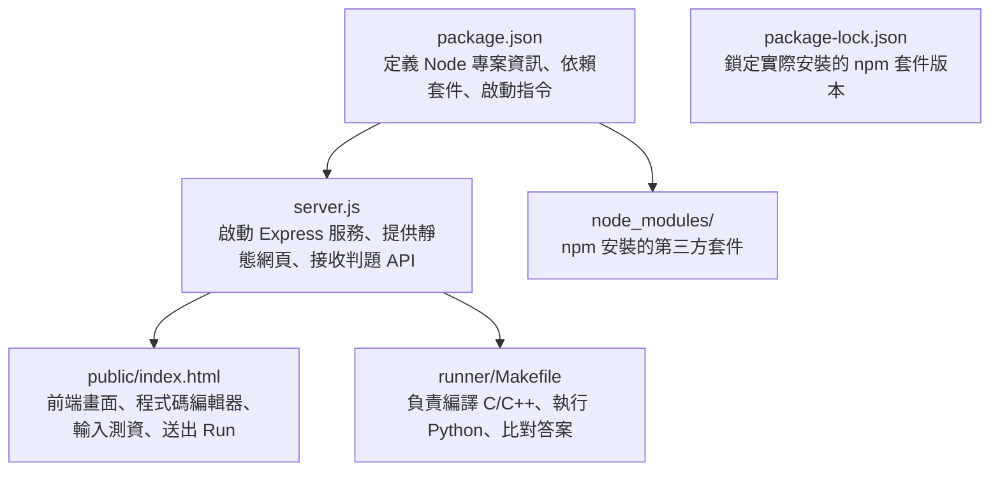
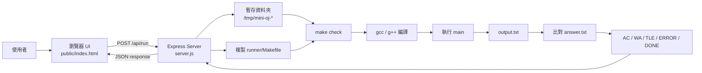
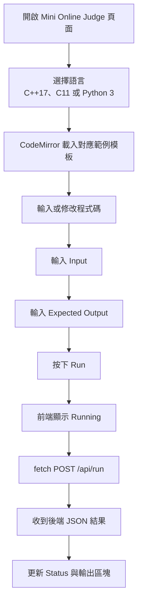
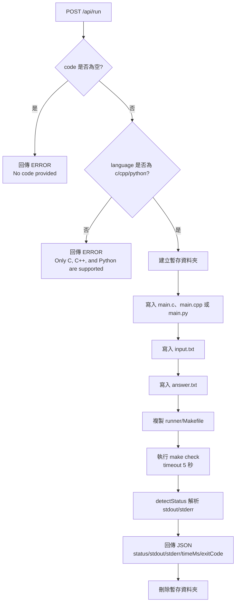
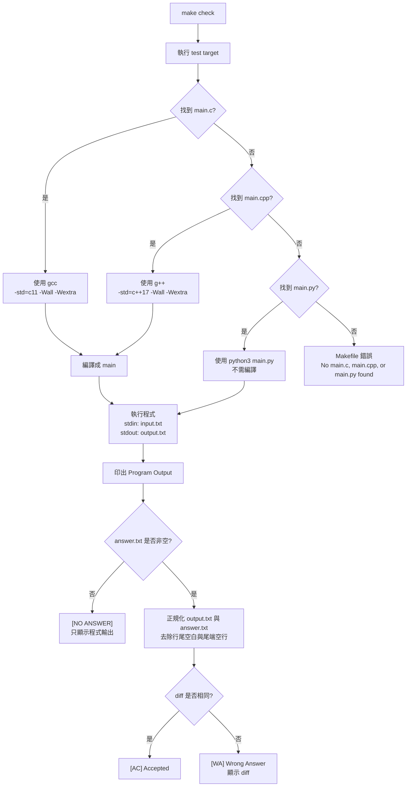
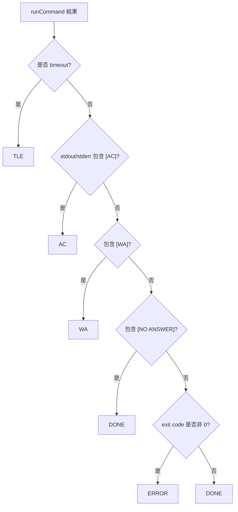

# Mini OJ 專案說明與流程圖

這個專案是一個支援 C / C++ / Python 的迷你 Online Judge。使用者在瀏覽器輸入程式碼、測資與預期輸出後，前端會呼叫後端 API；後端建立暫存執行環境，透過 `runner/Makefile` 編譯或執行程式並比對結果，最後把判題狀態回傳給前端。

## 1. 專案檔案在做什麼

### `package.json`

`package.json` 是 Node.js 專案設定檔，主要用途是描述這個專案需要什麼套件、怎麼啟動。

這個專案裡它做了幾件事：

- 宣告專案名稱是 `mini-oj`
- 指定主程式是 `server.js`
- 設定啟動指令：`npm start` 會執行 `node server.js`
- 宣告依賴套件：目前使用 `express`

簡單說：它是 Node 專案的入口設定表。

### `package-lock.json`

`package-lock.json` 是 npm 自動產生的鎖定檔，用來記錄實際安裝的套件版本。

它的用途是讓不同電腦執行 `npm install` 時，安裝到的套件版本盡量一致，避免「我電腦可以跑，你電腦不能跑」的問題。

### `node_modules/`

`node_modules/` 是 npm 安裝套件後產生的資料夾。

這個專案的 Express 框架和相關依賴都會放在這裡。通常不需要手動修改這個資料夾。

### `server.js`

`server.js` 是後端主程式，負責把整個 Online Judge 串起來。

它主要做這些事：

- 啟動 Express 伺服器，監聽 `3000` port
- 使用 `express.static("public")` 提供前端網頁
- 提供 `/api/run` API 給前端呼叫
- 檢查使用者送來的程式碼是否為空
- 檢查語言是否是 `c`、`cpp` 或 `python`
- 建立暫存資料夾
- 把使用者的程式碼寫成 `main.c`、`main.cpp` 或 `main.py`
- 把輸入資料寫成 `input.txt`
- 把預期答案寫成 `answer.txt`
- 複製 `runner/Makefile` 到暫存資料夾
- 執行 `make check`
- 解析執行結果，判斷是 `AC`、`WA`、`TLE`、`ERROR` 或 `DONE`
- 把結果用 JSON 回傳給前端
- 最後刪除暫存資料夾

簡單說：`server.js` 是前端和判題系統中間的橋樑。

### `public/index.html`

`public/index.html` 是前端頁面，使用者看到的介面都在這裡。

它包含三個部分：

- HTML：畫出標題、語言選單、Run 按鈕、程式碼區、Input、Expected Output、Result
- CSS：設定深色背景、雙欄版面、按鈕、文字區塊、結果區塊的樣式
- JavaScript：建立 CodeMirror 編輯器、切換 C/C++/Python 範例模板、送出程式碼到後端

使用者按下 `Run` 時，前端會把下面資料送到 `/api/run`：

- `code`：編輯器裡的程式碼
- `input`：測試輸入
- `answer`：預期輸出
- `language`：選擇的語言，`c` 或 `cpp`

收到後端結果後，它會更新畫面上的狀態和輸出內容。

簡單說：`public/index.html` 是使用者操作 Mini OJ 的地方。

### `runner/Makefile`

`runner/Makefile` 是真正負責「編譯、執行、比對答案」的檔案。

它會先判斷暫存資料夾裡有沒有 `main.c`、`main.cpp` 或 `main.py`：

- 如果有 `main.c`，就用 `gcc` 和 C11 標準編譯
- 如果有 `main.cpp`，就用 `g++` 和 C++17 標準編譯
- 如果有 `main.py`，就不編譯，直接用 `python3 main.py` 執行
- 如果三種檔案都沒有，就報錯

它的主要 target：

- `all`：編譯程式
- `run`：直接執行程式
- `test`：執行程式，將 `input.txt` 當 stdin，輸出到 `output.txt`
- `check`：執行 `test` 後，比對 `output.txt` 和 `answer.txt`
- `clean`：刪除編譯和比對過程產生的檔案

`check` 會做答案比對：

- 如果 `answer.txt` 是空的，輸出 `[NO ANSWER]`
- 如果輸出和答案相同，輸出 `[AC] Accepted`
- 如果不同，輸出 `[WA] Wrong Answer`，並顯示 diff

簡單說：`runner/Makefile` 是這個 Mini OJ 的判題核心。

## 2. 檔案之間怎麼串起來

## 3. 使用者操作流程

## 4. 後端 API 流程

## 5. Makefile 判題流程

## 6. 狀態判斷邏輯

## 7. 主要檔案責任總表

| 檔案 | 責任 |
| --- | --- |
| `public/index.html` | 前端畫面、CodeMirror 編輯器、語言模板、呼叫 `/api/run`、顯示結果 |
| `server.js` | Express 靜態檔案服務、API 驗證、暫存執行環境、執行 `make check`、解析狀態 |
| `runner/Makefile` | 判斷 C/C++/Python 原始碼、編譯或執行、輸出比對、產生 `[AC]` / `[WA]` / `[NO ANSWER]` |
| `package.json` | Node 專案設定與 `npm start` 啟動腳本 |
